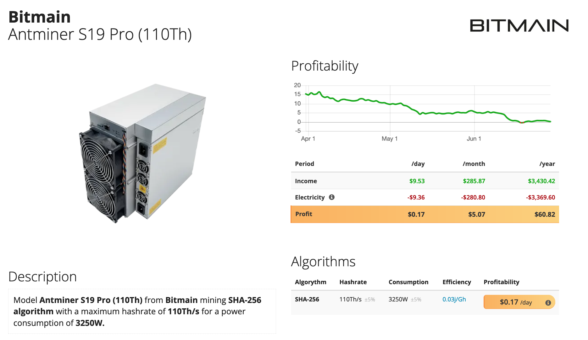

# Haket.info

---

> Quelle est la valeur du bitcoin ?

---

> Le bitcoin devait être une monnaie numérique pour un marché idéal et parfait pour les capitalistes libertaires. Au lieu de cela, le bitcoin s'est avéré profiter principalement aux banquiers et aux spéculateurs au détriment de l'environnement et de l'économie réelle.

---
> Une version purement peer-to-peer de la monnaie électronique permettrait d'envoyer des paiements en ligne directement d'une partie à une autre sans passer par une institution financière.

Livre blanc sur le bitcoin, "Satoshi Nakamoto" (en anglais)
---
- Le bitcoin a été créé pour être *un nouveau type d'argent* ancré dans la vision d'un marché non lié par la géographie, les banques et les gouvernements.

- Malgré les intentions de ses créateurs, *Bitcoin n'est pas de l'argent*.

- Il a été conçu avec une *compréhension défectueuse de l'argent* et, par conséquent, a une boucle de rétroaction positive qui a donné le coup d'envoi d'une bulle d'actifs.

- Afin de corriger ce bug, nous devons utiliser la *théorie du travail de la valeur*.
---
#### Le point de vue financier

L'argent est un instrument financier.

La valeur d'un instrument financier peut provenir du fait qu'il peut être remboursé à son émetteur, qu'il fournit un flux de revenus ou qu'il a une valeur garantie.

Selon ce point de vue, le bitcoin a une "juste valeur de zéro" et est purement spéculatif.

---
#### Le point de vue autrichien

L'argent est une marchandise, sa valeur est dérivée de sa valeur d'usage.

Un objet ne peut être utilisé comme monnaie que s'il possède déjà une valeur d'échange objective basée sur un autre usage.

Par conséquent, le point de vue autrichien est en accord avec le point de vue financier selon lequel le bitcoin n'a aucune valeur et est un actif purement spéculatif.

Ceci est ironique étant donné que de nombreux partisans du bitcoin imaginent qu'ils souscrivent à l'économie autrichienne, et c'est une raison pour laquelle le bitcoin a une offre maximale fixe, basée sur une mauvaise application de l'idée de "l'étalon-or."
---
#### La vision classique/marxiste

L'argent est une marchandise, sa valeur est dérivée de ses prix de production, qui eux-mêmes gravitent vers le temps de travail socialement nécessaire.

Appliquer le modèle classique à la monnaie "fiduciaire" moderne n'est pas du tout simple, mais il est tout à fait applicable au bitcoin, et cela permet également de comprendre pourquoi le bitcoin est cassé et ne peut donc pas fonctionner comme de la monnaie.

---
#### rapport prix/travail
Les matières premières sont rationnelles, les bitcoins et les objets de collection sont irrationnels.
<table>
<tr><td>Coconuts</td><td>Fongible</td><td>Des prix élevé attirent plus de travail</td><td>Plus de travail signifie plus d'offre</td></tr>.
<tr><td>Peintures</td><td>Non fongible</td><td>Des prix élevé n'attirent pas nécessairement plus de travail</td><td>Plus de travail ne cree pas plus d'offre</td></tr>.
<tr><td>Bitcoin</td><td>Fongible</td><td>Des prix élevés attirent plus de travail</td><td>Plus de travail ne cree pas plus d'offre</td></tr>.
</table>
---
#### Prix régulés par le marché

- noix de coco

prix élevé -> plus de travail élevé -> plus d'offre -> prix plus bas -> moins de travail -> moins d'offre -> prix plus élevée -> répétition.

*Les forces du marché régulent les prix*.

#### Boucle de rétroaction positive

-Bitcoin

prix élevé -> plus de travail disposant -> offre fixe -> prix plus élevé -> propager

prix bas -> moins de travail définis -> offre fixe -> prix plus bas -> répétition

*Les forces du marché exacerbent la volonté.

---
Les forces du marché exacerbent la réaliser* --- ### La récompense irrationnelle des blocs de Bitcoin crée une boucle de rétroaction positive qui fait exploser sa valeur.
---
- Bitcoin peut avoir une valeur stable si la récompense de bloc est fonction de la difficulté, et là pour plus de travail résulte en plus d'offre

- Sans le boom et le buste spectaculaires, il n'attirera pas autant d'attention et
intérêt, car il s'agit simplement d'un système de paiement numérique et non d'un moyen de s'enrichir rapidement
schème

#### Autres facteurs
- La spéculation, la confiance et le Grand Fou
- Compositions de portefeuille et le moment Minsky

---
### Bitcoin est de l'argent drôle
- de l'argent en jeu
- Irrationnel à cause du défaut de conception qui dissocie la récompense du bloc de la difficulté / du hachage / du travail

&nbsp;

### HAKET peut être un argent
- Une crypto-monnaie rationnelle
- la récompense de bloc est un rapport fixe à la quantité de hachage (travail) nécessaire pour vérifier le bloc

---
 
#### La valeur vient du travail

<petit>

Où est le travail dans une blockchain ? 
(en Bitcoin) 208915318781930100000 Opérations au niveau de la puce (Hachages) / s 
Le calcul est un travail physique 

</petit>

#### Travail mort et vivant
<small>
<table> <tr> <td>
<h4>travail mort </h4>
<ul><li>matériel informatique</li>
<li>réseau électrique / infrastructure</li></ul>
   </td>
<td center> <h4>travail vivant </h4>
<ul><li>Entretien</li>
  <li>Travail de bureau</li></ul>
   </td></tr></table>
</small>
---

 
au cours des derniers mois, pour la première fois, le prix du Bitcoin a fortement baissé tandis que la difficulté (hachage) a continué d'augmenter. Cela est probablement dû au fait qu'une nouvelle génération d'ASIC miniers, l'AntMiner S19, rend l'exploitation minière beaucoup plus économe en énergie.

---

 
Les hachages n'ont jamais été moins chers, ce qui implique que le prix du Bitcoin baisse vers son coût de production - de manière probabiliste, le coût proportionnel de tous les apports de main-d'œuvre au travail informatique pour extraire chaque Bitcoin.

---

La valeur de base d'un Bitcoin est tout le travail nécessaire pour maintenir l'offre fiable de Bitcoin en tant que service de transaction sécurisé cryptographiquement distribué.

---

Les services construits sur l'affordance du Bitcoin, basés sur la valeur du travail en Bitcoin, ajoutent de la valeur en fonction du travail supplémentaire dans le service, génèrent des profits selon le mode dominant (exploitation capitaliste des travailleurs).

---

Il n'y a pas de nouveau paradigme de valeur dans Bitcoin. Le bitcoin est un actif spéculatif dont le prix est dissocié de sa valeur et sera donc toujours volatil. Même chose pour Ethereum.

---

Haket peut fournir le même registre d'ajout uniquement vérifié par consensus distribué sans la volatilité spéculative de Bitcoin. Parce qu'il est rationnel, son prix représentera toujours une certaine quantité de travail.

---

### Parlons valeur dans notre atelier !
### ce qu'elle est, et ce pour quoi nous en avons besoin !

